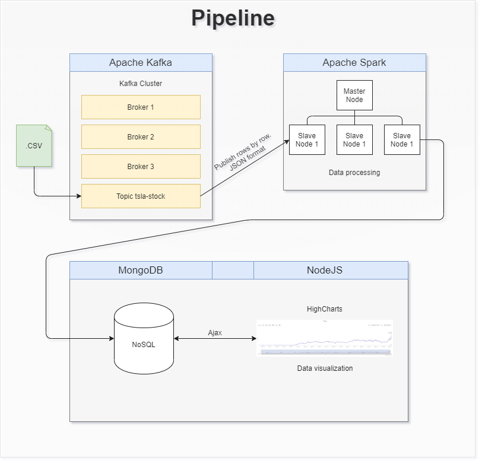

# Big data

Goal of this assignment was to demonstrate data pipeline from open datasource.  

I used CSV file that contained TSLA stock data from 2010-2020. The data was downloaded from [Yahoo Finance](https://finance.yahoo.com/quote/TSLA/history?p=TSLA).  

CSV file contained 2415 rows of following example data:  
*Date,Open,High,Low,Close,Adj Close,Volume  
2010-06-29,19.000000,25.000000,17.540001,23.889999,23.889999,18766300*

For programming environment I used Pouta CSC cloud computing service with multiple Ubuntu instances.

For this purpose I used a file, but this pipeline can be made with realtime data.

## Step-by step description of what was made

Kafka instance

* Download CSV file

* Read row by row and simultaneously process rows to JSON format

Spark instance

* Spark receives the data and makes data processing

  * Datatype changes

  * Date format yyyy-mm-dd to UNIX Epoch time

* Create MongoDB database and push data in it

MongoDB + NodeJS

* NodeJS creates network application which fetches data from MongoDB database and visualizes it with Highchart JS-library.

Pipeline architecture

Output